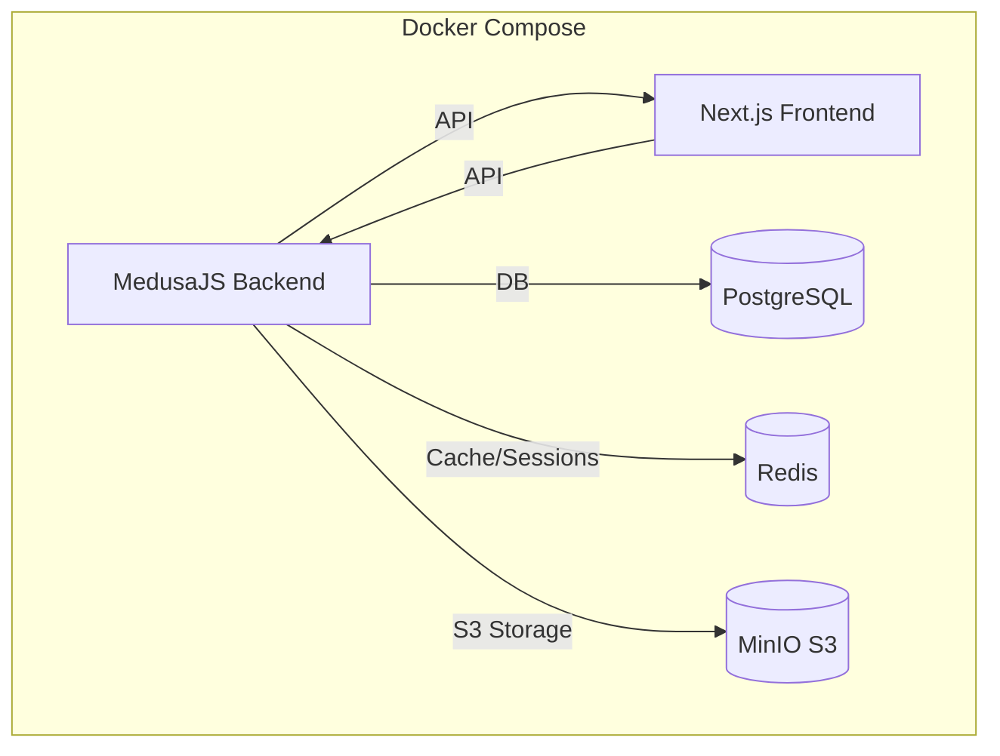
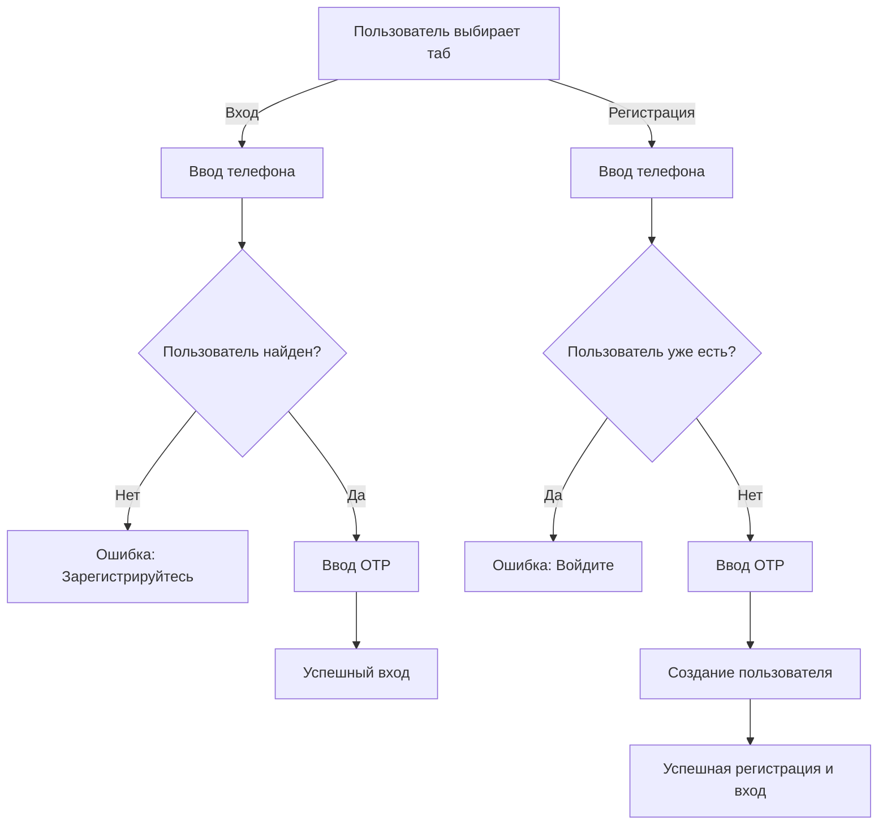

/**
 * @file: project.md
 * @description: Основной документ, описывающий архитектуру проекта, его компоненты и взаимодействие между ними.
 * @dependencies: N/A
 * @created: 2025-05-22
 */

# Project Ugodo

## 1. Введение
Разработка современной платформы для электронной коммерции Ugodo с фокусом на пользовательский опыт, гибкость управления и широкий ассортимент товаров. Проект стремится предоставить интуитивно понятный интерфейс для покупателей и эффективные инструменты для администраторов магазина.

## 2. Архитектура
Проект построен на базе headless-архитектуры, где фронтенд и бэкенд являются независимыми приложениями, взаимодействующими через API.

```mermaid
graph TD
    subgraph Пользовательский Интерфейс
        A[Клиент (Браузер/Мобильное приложение)]
    end
    subgraph Фронтенд (Next.js - Vercel/Docker)
        B(Next.js 15 + React 19)
        B -- Запросы API --> C
        B -- UI Компоненты --> H[@medusajs/ui]
        B -- Стилизация --> I[Tailwind CSS]
    end
    subgraph Бекенд (MedusaJS - Docker/Medusa Cloud)
        C{MedusaJS API v2.8+}
        C -- Управление данными --> D[PostgreSQL]
        C -- Поиск --> E[MeiliSearch]
        C -- Платежи --> F[Не определено/Stripe - требует уточнения]
        C -- Загрузка файлов --> G[MinIO (S3-совместимое хранилище, публичный bucket, CORS, интеграция через @medusajs/file-s3)]
        C -- Кеширование/Сессии --> M[Redis]
        C -- Уведомления --> K[Email/SMS (плагины)]
        C -- Программа лояльности --> L[Кастомный модуль/Плагин]
        C -- Аутентификация --> N[Email/Password + SMS OTP]
    end
    A --> B
```

### 2.1. Фронтенд
Фронтенд-приложение разработано с использованием **Next.js (версия 15)** и **React (версия 19)**. Это обеспечивает высокую производительность, серверный рендеринг (SSR) и статическую генерацию сайтов (SSG), что положительно сказывается на SEO и скорости загрузки.

- **Основные директории** (`src/`):
    - `app/`: Используется Next.js App Router для маршрутизации и организации страниц.
        - `[countryCode]/(main)/store`: Основная страница каталога товаров.
        - `[countryCode]/(main)/brands`: Страница со списком всех брендов (коллекций).
        - `[countryCode]/(main)/collections/[handle]`: Страница конкретного бренда/коллекции.
        - `[countryCode]/(main)/new-arrivals`: Страница новинок (товары отсортированы по дате создания).
        - `[countryCode]/(main)/bestsellers`: Страница хитов продаж (товары фильтруются по тегу `bestseller`).
        - Другие стандартные страницы: главная, поиск, корзина, аккаунт и т.д.
    - `lib/`: Содержит вспомогательные функции, утилиты, функции для взаимодействия с API MedusaJS (в частности, `@lib/data` для получения продуктов, коллекций, категорий, фильтров).
    - `modules/`: Включает переиспользуемые UI-компоненты и бизнес-логику, сгруппированные по доменным областям:
        - `products`: Компоненты для отображения информации о товаре, превью товара.
        - `store`: Компоненты для страницы каталога, включая фильтры (`ProductFilters`), отображение списка товаров (`StoreProductsDisplay`), пагинацию.
        - `collections`: Компоненты для страниц коллекций/брендов (`CollectionTemplate`, `CollectionProductsDisplay`).
        - `mobile`: Компоненты для мобильной навигации (`MobileNav`, `MobileBottomNav`).
        - `layout`: Общие компоненты макета, включая основную навигацию (`Nav`).
        - `common`: Общие компоненты, например, `LocalizedClientLink`.
        - `cart`, `checkout`, `account`: Модули для соответствующих разделов.
    - `styles/`: Глобальные стили (`globals.css`) и конфигурация Tailwind CSS.
- **UI и Стилизация**:
    - **@medusajs/ui**: Основная библиотека UI компонентов, предоставляемая MedusaJS.
    - **Tailwind CSS**: Утилитарный CSS-фреймворк для быстрой и гибкой стилизации.
    - **Headless UI / Radix UI**: Используются для базовых, доступных компонентов, стилизуемых с помощью Tailwind CSS.
    - **Lucide React**: Для SVG иконок.
- **Управление состоянием и данными**:
    - **React Query (`@tanstack/react-query`)**: Для управления состоянием сервера, кэширования данных.
    - **Medusa React (`medusa-react`)**: Предоставляет хуки и утилиты для взаимодействия с MedusaJS API.

### 2.2. Бекенд
Бэкенд построен на платформе **MedusaJS (версия ~2.8.x)**.

- **Основные директории** (`medusa/`):
    - `src/`: Кастомная бизнес-логика (API, модели, сервисы, подписчики).
    - `medusa-config.ts`: Конфигурация плагинов и модулей.
- **Ключевые возможности и плагины (текущие и потенциальные)**:
    - Управление товарами, заказами, клиентами.
    - **Платежная система**: Текущий статус не ясен (в `project.md` было пусто, ранее упоминался Stripe). Требуется интеграция (например, Stripe, YooKassa).
    - **Поиск**: Интеграция с MeiliSearch (`medusa-plugin-meilisearch`).
    - **Отзывы о товарах**: Плагины `@appateam/medusa-plugin-product-reviews` и/или `medusa-plugin-reviews`.
    - **Файловое хранилище**: MinIO (S3-совместимое, публичный bucket, CORS, интеграция через @medusajs/file-s3, bucket: medusa-uploads, endpoint: http://localhost:9000, forcePathStyle: true)
    - **Кеширование/Сессии**: Redis (интеграция через модуль @medusajs/cache-redis и переменные окружения)
    - **Уведомления**: Требуется настройка плагинов для email (SendGrid, Mailchimp) и, возможно, SMS.
    - **Список желаний (Wishlist)**: Может требовать кастомной реализации или поиска плагина.
    - **Программа лояльности**: Бонусы, скидки – вероятно, потребует кастомной разработки или специализированного плагина.
    - **Аутентификация**: Реализована двумя независимыми флоу:
        - **Регистрация по SMS**: Отдельная форма и логика для регистрации нового пользователя по SMS (компонент RegisterSms, страница /account/register-sms).
        - **Авторизация по SMS**: Отдельная форма и логика для входа по SMS (компонент LoginSms, страница /account/login-sms).
      Пользователь явно выбирает нужный сценарий ("Вход по SMS" или "Регистрация по SMS"). UI и серверные actions разделены для login и register.
      
      **Flow регистрации по SMS (актуальный):**
      1. Пользователь вводит номер телефона на странице регистрации.
      2. Фронтенд вызывает `/auth/customer/otp/pre-register` — отправляется OTP-код.
      3. Пользователь вводит полученный код.
      4. Фронтенд вызывает `/auth/customer/otp/register` — получает `registration_token`.
      5. Фронтенд вызывает `/store/customers` с `registration_token` и номером телефона — создаётся пользователь.
      6. Фронтенд вызывает `/auth/customer/otp/authenticate` — выполняется автоматический вход.
      7. Пользователь перенаправляется в личный кабинет.

      ```mermaid
      sequenceDiagram
        participant U as User
        participant FE as Frontend (Next.js)
        participant BE as MedusaJS + PerseidesJS
        U->>FE: Вводит телефон
        FE->>BE: POST /auth/customer/otp/pre-register
        BE-->>FE: 200 OK (OTP отправлен)
        U->>FE: Вводит OTP
        FE->>BE: POST /auth/customer/otp/register
        BE-->>FE: 200 OK (registration_token)
        FE->>BE: POST /store/customers (registration_token, phone)
        BE-->>FE: 200 OK (customer создан)
        FE->>BE: POST /auth/customer/otp/authenticate (phone, otp)
        BE-->>FE: 200 OK (token)
        FE->>U: Перенаправление в профиль
      ```

### 2.3. База данных
- **PostgreSQL**: Основная СУБД для MedusaJS.

### 2.3. API и Интеграции

- **API**: Полностью задокументировано с использованием Swagger/OpenAPI.
  - **Основная документация**: Доступна по адресу `/doc` (например, http://localhost:9000/doc).
  - **Документация для фронтенда**: Доступна по адресу `/doc/storefront` (например, http://localhost:9000/doc/storefront).
  - **OTP API**: Специфические эндпоинты для SMS авторизации доступны в разделе "Customer OTP Auth" в документации фронтенда. Основные эндпоинты:
    - `/auth/customer/otp/pre-register` - запрос OTP для регистрации
    - `/auth/customer/otp/verify` - проверка OTP без создания сессии
    - `/auth/customer/otp/register` - регистрация с использованием OTP
    - `/auth/customer/otp/authenticate` - авторизация с использованием OTP
  - **Спецификация для OTP**: Отдельная спецификация OTP API также доступна в файле `docs/otp_api.yaml`.

## 3. Ключевые Компоненты и Модули
- **Каталог товаров**: Включает страницы `/store`, `/brands`, `/collections/[handle]`, `/new-arrivals`, `/bestsellers` с фильтрацией, сортировкой и пагинацией.
- **Фильтрация товаров**: Реализована с использованием `ProductFilters` на основе категорий, типов, тегов и диапазона цен.
- **Навигация**: Десктопная (`Nav`) и мобильная (`MobileNav`, `MobileBottomNav`) навигация, обеспечивающая доступ ко всем основным разделам.
- **Карточка товара (`ProductPreview`)**: Отображает основную информацию о товаре в списках.
- **Страница товара**: Детальное описание, изображения, опции, добавление в корзину (требует более детального описания по мере реализации).
- **Корзина и оформление заказа**: Стандартный функционал Medusa, требующий настройки и кастомизации UI.
- **Личный кабинет пользователя**: Обзор, профиль, адреса, заказы.

## 4. Технологический Стек
- **Фронтенд**:
    - Фреймворк: Next.js 15
    - Библиотека UI: React 19, @medusajs/ui, Radix UI (для примитивов)
    - Стилизация: Tailwind CSS
    - Управление состоянием: React Query, Medusa React
    - Иконки: Lucide React
    - Карусели: Embla Carousel
- **Бекенд**:
    - Платформа: MedusaJS (~2.8.x)
    - Язык: TypeScript
    - База данных: PostgreSQL
    - Поиск: MeiliSearch
    - Платежи: (Не определено/Stripe - требует уточнения)
    - Отзывы: `@appateam/medusa-plugin-product-reviews`, `medusa-plugin-reviews`
    - Файловое хранилище: MinIO (S3-совместимое, публичный bucket, CORS, интеграция через @medusajs/file-s3, bucket: medusa-uploads, endpoint: http://localhost:9000, forcePathStyle: true)
    - Кеширование/Сессии: Redis (интеграция через модуль @medusajs/cache-redis и переменные окружения)
    - SMS-провайдер: SMSC.ru для отправки SMS-кодов
- **Инструменты сборки и разработки**:
    - Менеджер пакетов: Yarn
    - Линтинг: ESLint
    - Форматирование: Prettier
- **Другие используемые технологии**:
    - API документация: Swagger/OpenAPI (генерируется Medusa)

## 5. Стандарты Кодирования и Соглашения
- Используется TypeScript.
- Форматирование: Prettier.
- Линтинг: ESLint.
- Коммиты: Conventional Commits.

## 6. Развертывание

### 6.1. Методы развертывания
- **PM2** (через `ecosystem.config.js`) для Node.js процессов.
- **Docker Compose** для локальной разработки и production сред.
- Потенциально Vercel для фронтенда, Medusa Cloud для бэкенда.

### 6.2. Автоматизированные инструменты
- **`./deploy.sh`** - Скрипт автоматического развертывания с поддержкой Docker и PM2.
- **`./monitor.sh`** - Мониторинг статуса сервисов и здоровья приложения.
- **`./fix-git-divergent.sh`** - Решение проблем с Git при обновлении.

### 6.3. Быстрое обновление проекта
Для обновления кодовой базы с GitHub используйте:

```bash
# Краткий метод
git pull origin main && ./deploy.sh auto

# Docker
docker compose down && docker compose build --no-cache && docker compose up -d

# PM2
cd medusa && yarn install && yarn build && cd .. && yarn install && yarn build && pm2 restart all
```

### 6.4. Документация по развертыванию
- **[QUICK_UPDATE_GUIDE.md](../QUICK_UPDATE_GUIDE.md)** - Краткая инструкция по обновлению
- **[DEPLOY_GUIDE.md](../DEPLOY_GUIDE.md)** - Полная инструкция по развертыванию
- **[EMERGENCY.md](../EMERGENCY.md)** - Экстренное восстановление

### 6.5. Мониторинг и поддержка
- Проверка статуса: `./monitor.sh`
- Просмотр логов: `pm2 logs` или `docker compose logs -f`
- Health checks: автоматическая проверка доступности API endpoints

Все локальные настройки Redis и MinIO упакованы в Docker для удобства развертывания и масштабирования.

## 7. Диаграммы (Mermaid)
(Основная архитектурная диаграмма приведена выше)

## 8. План развития и будущие функции (Roadmap High-Level)
(Этот раздел будет формироваться на основе анализа и новых задач из `tasktracker.md`)
- Улучшенная система фильтрации и поиска.
- Программа лояльности и система бонусов.
- Интеграция с различными службами доставки.
- Полноценная система отзывов и рейтингов.
- Мобильное приложение (в перспективе).
- Расширенные возможности управления контентом (блог, статьи).

## 9. Структура главной страницы (`/`)
Главная страница должна служить витриной магазина, привлекать внимание к ключевым предложениям и облегчать навигацию по основным разделам.

### 9.1. Компоненты главной страницы:

1.  **Hero Section (Главный баннер/слайдер) - Компонент: `Hero` (`src/modules/home/components/hero/index.tsx`)**
    *   **Описание**: Яркий, привлекающий внимание блок в верхней части страницы. Представляет собой карусель (слайдер) из 2-3 изображений/видео.
    *   **Содержимое**: Актуальные акции, сезонные предложения, новые коллекции, ключевые УТП. (В текущей реализации данные захардкожены в компоненте).
    *   **CTA**: Кнопки типа "Подробнее", "В каталог", "Купить".
    *   **Источник данных**: В текущей реализации данные захардкожены. В перспективе - статичный контент или управляемый через метаданные (например, специальная коллекция "Главный баннер" в MedusaJS, где каждый товар — это слайд с изображением в `thumbnail` и ссылкой/текстом в `metadata`).

2.  **Популярные Категории**
    *   **Описание**: Блок с 3-6 карточками, представляющими наиболее востребованные или стратегически важные категории товаров.
    *   **Содержимое**: Изображение категории, название категории.
    *   **CTA**: Переход на страницу соответствующей категории.
    *   **Источник данных**: Список категорий из MedusaJS (возможно, с ручным выбором или на основе аналитики популярности в будущем).

3.  **Новинки**
    *   **Описание**: Горизонтальная карусель или сетка из 4-8 карточек товаров.
    *   **Содержимое**: Превью товаров (изображение, название, цена).
    *   **CTA**: Переход на страницу товара, кнопка "Добавить в корзину" (если применимо).
    *   **Источник данных**: Продукты, отсортированные по дате создания (`created_at DESC`) из MedusaJS.

4.  **Хиты Продаж (Бестселлеры)**
    *   **Описание**: Горизонтальная карусель или сетка из 4-8 карточек товаров.
    *   **Содержимое**: Превью товаров.
    *   **CTA**: Переход на страницу товара.
    *   **Источник данных**: Продукты с тегом `bestseller` или на основе будущей логики анализа продаж (пока используем тег).

5.  **Специальные Акции / Распродажа**
    *   **Описание**: Блок (карусель или выделенная секция) с товарами, на которые действуют скидки.
    *   **Содержимое**: Превью товаров с указанием старой и новой цены, размера скидки.
    *   **CTA**: Переход на страницу товара или на специальную страницу распродажи.
    *   **Источник данных**: Продукты с установленными ценами типа `sale` в MedusaJS. Требует проверки, как MedusaJS обрабатывает скидки на уровне вариантов и как это лучше запрашивать.

6.  **Бренды (опционально, если актуально для магазина)**
    *   **Описание**: Карусель или логотипы популярных/ключевых брендов.
    *   **Содержимое**: Логотип бренда.
    *   **CTA**: Переход на страницу бренда (коллекции).
    *   **Источник данных**: Список коллекций (брендов) из MedusaJS.

7.  **Контентный блок (например, "О нас" или блог-превью) - *УДАЛЕН С ГЛАВНОЙ СТРАНИЦЫ***
    *   **Описание**: ~~Небольшой текстовый блок или превью последних статей из блога (если блог будет реализован).~~ Блок был удален с главной страницы.
    *   **Содержимое**: ~~Краткий текст о магазине, его миссии, или заголовки и краткие анонсы статей.~~
    *   **CTA**: ~~Ссылка на страницу "О нас" или на блог.~~
    *   **Источник данных**: ~~Статичный текст или данные из модуля блога.~~

8.  **Подписка на рассылку**
    *   **Описание**: Простая форма для ввода email.
    *   **Содержимое**: Поле для email, кнопка "Подписаться".
    *   **CTA**: Подтверждение подписки.
    *   **Источник данных**: Интеграция с сервисом рассылок или сохранение в Medusa (если есть плагин).

### 9.2. Общие принципы:
*   **Адаптивность**: Все блоки должны корректно отображаться на мобильных устройствах, планшетах и десктопах.
*   **Производительность**: Оптимизация изображений, ленивая загрузка (lazy loading) для контента ниже первого экрана.
*   **Доступность (A11y)**: Соблюдение стандартов доступности.
*   **Единый стиль**: Соответствие общему дизайну и UI-киту (`@medusajs/ui` и Tailwind CSS).

## 10. Docker-инфраструктура (production)



- Все сервисы запускаются одной командой: `docker compose up -d`
- Используются только production-конфигурации (без dev/hot-reload)
- Переменные окружения для каждого сервиса описаны в `.env` и пробрасываются в контейнеры
- Для хранения данных используются volume (Postgres, MinIO)
- MinIO доступен по порту 9000 (API) и 9001 (консоль)
- Next.js и Medusa доступны на портах 3000 и 9000 соответственно (может быть изменено в compose)

### Файловое хранилище (MinIO + S3)
- Для хранения изображений и других файлов используется MinIO, развернутый локально (http://localhost:9001/browser/medusa-uploads).
- Интеграция с MedusaJS реализована через модуль @medusajs/file-s3 с параметрами:
  - bucket: medusa-uploads
  - endpoint: http://localhost:9000
  - region: us-east-1
  - access_key_id/secret_access_key: minioadmin/minioadmin (по умолчанию для локального Minio)
  - additional_client_config.forcePathStyle: true (обязательно для Minio)
- Такой подход обеспечивает совместимость с AWS S3 API, возможность масштабирования и переносимости между облачными и on-premise решениями.

## 11. API Документация

### 11.1 API Аутентификации

#### 11.1.1 SMS OTP Аутентификация
Кастомные эндпоинты для аутентификации через SMS OTP описаны в отдельном Swagger/OpenAPI файле.

- **Расположение спецификации**: `docs/otp_api.yaml`
- **Краткое описание**: Предоставляет эндпоинты для запроса OTP, регистрации нового пользователя с OTP, верификации OTP (что может приводить к логину существующего пользователя) и прямой аутентификации с OTP.
- **Основные эндпоинты**:
    - `POST /store/auth/customer/otp/pre-register`: Запрос на отправку OTP.
    - `POST /store/auth/customer/otp/register`: Регистрация нового пользователя с OTP.
    - `POST /store/auth/customer/otp/verify`: Проверка OTP (может использоваться и для логина, и как шаг перед регистрацией).
    - `POST /store/auth/customer/otp/authenticate`: Аутентификация существующего пользователя с OTP.

Детальное описание запросов, ответов и схем данных смотрите в файле `docs/otp_api.yaml`.

## Актуализация архитектуры: SMS-авторизация и регистрация на одной странице

### Новый UX и архитектура
- Страница `/account/sms-auth` реализует два независимых сценария:
  - **Вход по SMS**: только для существующих пользователей (POST /auth/customer/otp/generate → /verify)
  - **Регистрация по SMS**: только для новых пользователей (POST /auth/customer/otp/pre-register → /register → /store/customers → /authenticate)
- Переключение между сценариями через табы (UI на @medusajs/ui)
- Ошибки и переходы реализованы согласно best practice PerseidesJS (например, если номер уже есть при регистрации — предложение войти)

### Взаимодействие с API PerseidesJS
- Вход: /auth/customer/otp/generate → /auth/customer/otp/verify
- Регистрация: /auth/customer/otp/pre-register → /auth/customer/otp/register → /store/customers → /auth/customer/otp/authenticate

### Диаграмма флоу (Mermaid)


### Обновлено: 2024-08-01

### UX и технические детали
- После успешной авторизации или регистрации (SMS и email/пароль) всегда используется router.replace('/account') для редиректа.
- Это гарантирует, что SSR Next.js увидит новую куку и личный кабинет отобразится корректно.
- window.location.href и router.push не используются для редиректа после входа.

## 13. Поддержка видеофайлов для товаров в админке Medusa

### Требования
- К каждому товару можно прикрепить несколько видеофайлов (как и несколько изображений)
- Поддерживаемые форматы видео: mp4, webm
- Максимальный размер видеофайла: 10 МБ
- Загрузка видео поддерживает drag & drop (аналогично изображениям)
- В списке медиа для товара видео отображается как миниатюра (thumbnail)
- Видео хранится в том же бакете S3/MinIO, что и изображения

### Архитектура
- Расширяется enum MediaType: добавляется VIDEO
- В UI админки (раздел Media товара) появляется возможность выбрать тип медиа (image/video) при добавлении файла
- Для видеофайлов разрешена загрузка только mp4 и webm, с ограничением размера 10 МБ
- В backend и БД у каждого медиафайла хранится тип (image/video)
- В списке медиа для товара видео отображается как миниатюра (генерируется автоматически или используется placeholder)
- Drag & drop работает для всех типов медиа
- При клике на миниатюру видео открывается modal с плеером

### UX
- Всё реализовано в рамках одного раздела Media (без отдельных табов)
- Пользователь может загружать, удалять, сортировать и просматривать как изображения, так и видео
- Для видео отображается миниатюра и иконка play

### Документировано: 2024-06-13

## Поддержка видео в медиа товаров (product-media)

### Архитектура и best practice Medusa v2
- Видео и изображения хранятся в одной таблице (product_media) с полем type (image/video).
- Для хранения файлов используется File Module (S3/MinIO), в product_media хранится fileId или url.
- Для связи с продуктом используется module link между Product и ProductMedia.
- CRUD-операции с медиа реализуются через сервис product-media, а не через отдельные кастомные API.
- Загрузка файлов — только через File Module, создание записи — через сервис product-media.
- В админке видео и изображения отображаются в одном списке, с превью и возможностью просмотра.
- В ответах на запросы к продукту (например, /admin/products/:id?fields=+media.*) возвращаются все связанные медиа.

### План внедрения
1. Реализовать module link между Product и ProductMedia.
2. Добавить методы в сервис product-media для создания/удаления/получения медиа.
3. Обновить документацию (changelog, tasktracker, project.md).
4. На фронте использовать File Module для загрузки, а сервис product-media для создания записи.
5. В админке расширить UI для отображения и управления видео в общем списке медиа.

### Пример best practice (Medusa v2)
- [DigitalProductMedia model](https://github.com/medusajs/medusa/blob/develop/www/apps/resources/app/recipes/digital-products/examples/standard/page.mdx#_snippet_2)
- [Module link](https://github.com/medusajs/medusa/blob/develop/www/apps/resources/app/commerce-modules/product/extend/page.mdx#_snippet_1)
- [Расширение ответа продукта](https://github.com/medusajs/medusa/blob/develop/www/apps/resources/app/commerce-modules/product/extend/page.mdx#_snippet_9)

---

## Текущий статус
- Миграции product_media применены, структура модуля приведена к стандарту Medusa v2.
- Следующий этап: module link, CRUD-сервис, фронт и UI.
