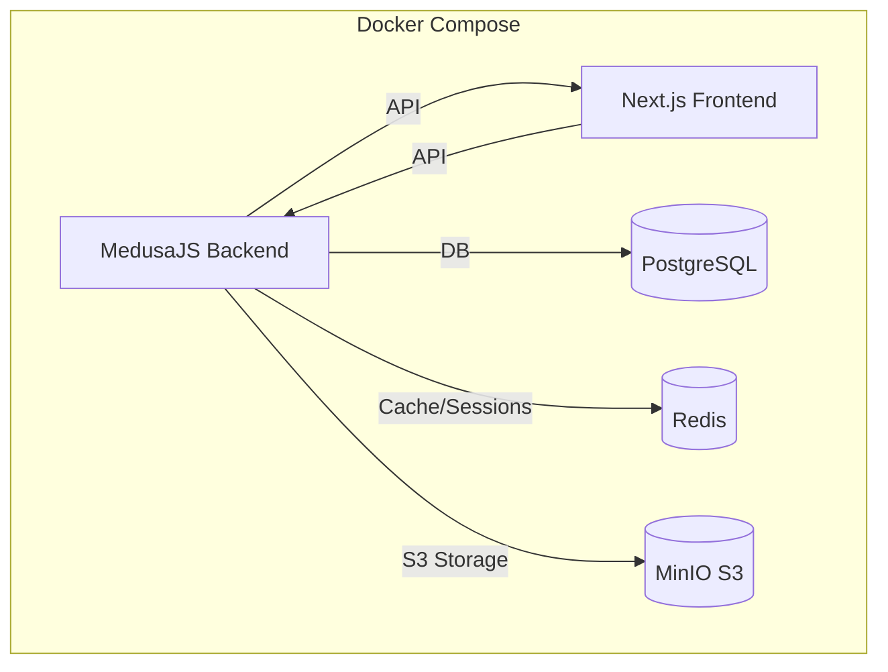

# Описание Проекта Ugodo

## 1. Введение
Разработка современной платформы для электронной коммерции Ugodo с фокусом на пользовательский опыт, гибкость управления и широкий ассортимент товаров. Проект стремится предоставить интуитивно понятный интерфейс для покупателей и эффективные инструменты для администраторов магазина.

## 2. Архитектура
Проект построен на базе headless-архитектуры, где фронтенд и бэкенд являются независимыми приложениями, взаимодействующими через API.

```mermaid
graph TD
    subgraph Пользовательский Интерфейс
        A[Клиент (Браузер/Мобильное приложение)]
    end
    subgraph Фронтенд (Next.js - Vercel/Docker)
        B(Next.js 15 + React 19)
        B -- Запросы API --> C
        B -- UI Компоненты --> H[@medusajs/ui]
        B -- Стилизация --> I[Tailwind CSS]
    end
    subgraph Бекенд (MedusaJS - Docker/Medusa Cloud)
        C{MedusaJS API v2.8+}
        C -- Управление данными --> D[PostgreSQL]
        C -- Поиск --> E[MeiliSearch]
        C -- Платежи --> F[Не определено/Stripe - требует уточнения]
        C -- Загрузка файлов --> G[MinIO (S3-совместимое хранилище, публичный bucket, CORS, интеграция через @medusajs/file-s3)]
        C -- Кеширование/Сессии --> M[Redis]
        C -- Уведомления --> K[Email/SMS (плагины)]
        C -- Программа лояльности --> L[Кастомный модуль/Плагин]
    end
    A --> B
```

### 2.1. Фронтенд
Фронтенд-приложение разработано с использованием **Next.js (версия 15)** и **React (версия 19)**. Это обеспечивает высокую производительность, серверный рендеринг (SSR) и статическую генерацию сайтов (SSG), что положительно сказывается на SEO и скорости загрузки.

- **Основные директории** (`src/`):
    - `app/`: Используется Next.js App Router для маршрутизации и организации страниц.
        - `[countryCode]/(main)/store`: Основная страница каталога товаров.
        - `[countryCode]/(main)/brands`: Страница со списком всех брендов (коллекций).
        - `[countryCode]/(main)/collections/[handle]`: Страница конкретного бренда/коллекции.
        - `[countryCode]/(main)/new-arrivals`: Страница новинок (товары отсортированы по дате создания).
        - `[countryCode]/(main)/bestsellers`: Страница хитов продаж (товары фильтруются по тегу `bestseller`).
        - Другие стандартные страницы: главная, поиск, корзина, аккаунт и т.д.
    - `lib/`: Содержит вспомогательные функции, утилиты, функции для взаимодействия с API MedusaJS (в частности, `@lib/data` для получения продуктов, коллекций, категорий, фильтров).
    - `modules/`: Включает переиспользуемые UI-компоненты и бизнес-логику, сгруппированные по доменным областям:
        - `products`: Компоненты для отображения информации о товаре, превью товара.
        - `store`: Компоненты для страницы каталога, включая фильтры (`ProductFilters`), отображение списка товаров (`StoreProductsDisplay`), пагинацию.
        - `collections`: Компоненты для страниц коллекций/брендов (`CollectionTemplate`, `CollectionProductsDisplay`).
        - `mobile`: Компоненты для мобильной навигации (`MobileNav`, `MobileBottomNav`).
        - `layout`: Общие компоненты макета, включая основную навигацию (`Nav`).
        - `common`: Общие компоненты, например, `LocalizedClientLink`.
        - `cart`, `checkout`, `account`: Модули для соответствующих разделов.
    - `styles/`: Глобальные стили (`globals.css`) и конфигурация Tailwind CSS.
- **UI и Стилизация**:
    - **@medusajs/ui**: Основная библиотека UI компонентов, предоставляемая MedusaJS.
    - **Tailwind CSS**: Утилитарный CSS-фреймворк для быстрой и гибкой стилизации.
    - **Headless UI / Radix UI**: Используются для базовых, доступных компонентов, стилизуемых с помощью Tailwind CSS.
    - **Lucide React**: Для SVG иконок.
- **Управление состоянием и данными**:
    - **React Query (`@tanstack/react-query`)**: Для управления состоянием сервера, кэширования данных.
    - **Medusa React (`medusa-react`)**: Предоставляет хуки и утилиты для взаимодействия с MedusaJS API.

### 2.2. Бекенд
Бэкенд построен на платформе **MedusaJS (версия ~2.8.x)**.

- **Основные директории** (`medusa/`):
    - `src/`: Кастомная бизнес-логика (API, модели, сервисы, подписчики).
    - `medusa-config.ts`: Конфигурация плагинов и модулей.
- **Ключевые возможности и плагины (текущие и потенциальные)**:
    - Управление товарами, заказами, клиентами.
    - **Платежная система**: Текущий статус не ясен (в `project.md` было пусто, ранее упоминался Stripe). Требуется интеграция (например, Stripe, YooKassa).
    - **Поиск**: Интеграция с MeiliSearch (`medusa-plugin-meilisearch`).
    - **Отзывы о товарах**: Плагины `@appateam/medusa-plugin-product-reviews` и/или `medusa-plugin-reviews`.
    - **Файловое хранилище**: MinIO (S3-совместимое, публичный bucket, CORS, интеграция через @medusajs/file-s3, bucket: medusa-uploads, endpoint: http://localhost:9000, forcePathStyle: true)
    - **Кеширование/Сессии**: Redis (интеграция через модуль @medusajs/cache-redis и переменные окружения)
    - **Уведомления**: Требуется настройка плагинов для email (SendGrid, Mailchimp) и, возможно, SMS.
    - **Список желаний (Wishlist)**: Может требовать кастомной реализации или поиска плагина.
    - **Программа лояльности**: Бонусы, скидки – вероятно, потребует кастомной разработки или специализированного плагина.

### 2.3. База данных
- **PostgreSQL**: Основная СУБД для MedusaJS.

## 3. Ключевые Компоненты и Модули
- **Каталог товаров**: Включает страницы `/store`, `/brands`, `/collections/[handle]`, `/new-arrivals`, `/bestsellers` с фильтрацией, сортировкой и пагинацией.
- **Фильтрация товаров**: Реализована с использованием `ProductFilters` на основе категорий, типов, тегов и диапазона цен.
- **Навигация**: Десктопная (`Nav`) и мобильная (`MobileNav`, `MobileBottomNav`) навигация, обеспечивающая доступ ко всем основным разделам.
- **Карточка товара (`ProductPreview`)**: Отображает основную информацию о товаре в списках.
- **Страница товара**: Детальное описание, изображения, опции, добавление в корзину (требует более детального описания по мере реализации).
- **Корзина и оформление заказа**: Стандартный функционал Medusa, требующий настройки и кастомизации UI.
- **Личный кабинет пользователя**: Обзор, профиль, адреса, заказы.

## 4. Технологический Стек
- **Фронтенд**:
    - Фреймворк: Next.js 15
    - Библиотека UI: React 19, @medusajs/ui, Radix UI (для примитивов)
    - Стилизация: Tailwind CSS
    - Управление состоянием: React Query, Medusa React
    - Иконки: Lucide React
    - Карусели: Embla Carousel
- **Бекенд**:
    - Платформа: MedusaJS (~2.8.x)
    - Язык: TypeScript
    - База данных: PostgreSQL
    - Поиск: MeiliSearch
    - Платежи: (Не определено/Stripe - требует уточнения)
    - Отзывы: `@appateam/medusa-plugin-product-reviews`, `medusa-plugin-reviews`
    - Файловое хранилище: MinIO (S3-совместимое, публичный bucket, CORS, интеграция через @medusajs/file-s3, bucket: medusa-uploads, endpoint: http://localhost:9000, forcePathStyle: true)
    - Кеширование/Сессии: Redis (интеграция через модуль @medusajs/cache-redis и переменные окружения)
- **Инструменты сборки и разработки**:
    - Менеджер пакетов: Yarn
    - Линтинг: ESLint
    - Форматирование: Prettier
- **Другие используемые технологии**:
    - API документация: Swagger/OpenAPI (генерируется Medusa)

## 5. Стандарты Кодирования и Соглашения
- Используется TypeScript.
- Форматирование: Prettier.
- Линтинг: ESLint.
- Коммиты: Conventional Commits.

## 6. Развертывание
- PM2 (через `ecosystem.config.js`) для Node.js.
- Потенциально Vercel для фронтенда, Medusa Cloud для бэкенда.
- Все локальные настройки Redis и MinIO должны быть упакованы в Docker для удобства развертывания и масштабирования (см. задачи в tasktracker.md).

## 7. Диаграммы (Mermaid)
(Основная архитектурная диаграмма приведена выше)

## 8. План развития и будущие функции (Roadmap High-Level)
(Этот раздел будет формироваться на основе анализа и новых задач из `tasktracker.md`)
- Улучшенная система фильтрации и поиска.
- Программа лояльности и система бонусов.
- Интеграция с различными службами доставки.
- Полноценная система отзывов и рейтингов.
- Мобильное приложение (в перспективе).
- Расширенные возможности управления контентом (блог, статьи).

## 9. Структура главной страницы (`/`)
Главная страница должна служить витриной магазина, привлекать внимание к ключевым предложениям и облегчать навигацию по основным разделам.

### 9.1. Компоненты главной страницы:

1.  **Hero Section (Главный баннер/слайдер) - Компонент: `Hero` (`src/modules/home/components/hero/index.tsx`)**
    *   **Описание**: Яркий, привлекающий внимание блок в верхней части страницы. Представляет собой карусель (слайдер) из 2-3 изображений/видео.
    *   **Содержимое**: Актуальные акции, сезонные предложения, новые коллекции, ключевые УТП. (В текущей реализации данные захардкожены в компоненте).
    *   **CTA**: Кнопки типа "Подробнее", "В каталог", "Купить".
    *   **Источник данных**: В текущей реализации данные захардкожены. В перспективе - статичный контент или управляемый через метаданные (например, специальная коллекция "Главный баннер" в MedusaJS, где каждый товар — это слайд с изображением в `thumbnail` и ссылкой/текстом в `metadata`).

2.  **Популярные Категории**
    *   **Описание**: Блок с 3-6 карточками, представляющими наиболее востребованные или стратегически важные категории товаров.
    *   **Содержимое**: Изображение категории, название категории.
    *   **CTA**: Переход на страницу соответствующей категории.
    *   **Источник данных**: Список категорий из MedusaJS (возможно, с ручным выбором или на основе аналитики популярности в будущем).

3.  **Новинки**
    *   **Описание**: Горизонтальная карусель или сетка из 4-8 карточек товаров.
    *   **Содержимое**: Превью товаров (изображение, название, цена).
    *   **CTA**: Переход на страницу товара, кнопка "Добавить в корзину" (если применимо).
    *   **Источник данных**: Продукты, отсортированные по дате создания (`created_at DESC`) из MedusaJS.

4.  **Хиты Продаж (Бестселлеры)**
    *   **Описание**: Горизонтальная карусель или сетка из 4-8 карточек товаров.
    *   **Содержимое**: Превью товаров.
    *   **CTA**: Переход на страницу товара.
    *   **Источник данных**: Продукты с тегом `bestseller` или на основе будущей логики анализа продаж (пока используем тег).

5.  **Специальные Акции / Распродажа**
    *   **Описание**: Блок (карусель или выделенная секция) с товарами, на которые действуют скидки.
    *   **Содержимое**: Превью товаров с указанием старой и новой цены, размера скидки.
    *   **CTA**: Переход на страницу товара или на специальную страницу распродажи.
    *   **Источник данных**: Продукты с установленными ценами типа `sale` в MedusaJS. Требует проверки, как MedusaJS обрабатывает скидки на уровне вариантов и как это лучше запрашивать.

6.  **Бренды (опционально, если актуально для магазина)**
    *   **Описание**: Карусель или логотипы популярных/ключевых брендов.
    *   **Содержимое**: Логотип бренда.
    *   **CTA**: Переход на страницу бренда (коллекции).
    *   **Источник данных**: Список коллекций (брендов) из MedusaJS.

7.  **Контентный блок (например, "О нас" или блог-превью) - *УДАЛЕН С ГЛАВНОЙ СТРАНИЦЫ***
    *   **Описание**: ~~Небольшой текстовый блок или превью последних статей из блога (если блог будет реализован).~~ Блок был удален с главной страницы.
    *   **Содержимое**: ~~Краткий текст о магазине, его миссии, или заголовки и краткие анонсы статей.~~
    *   **CTA**: ~~Ссылка на страницу "О нас" или на блог.~~
    *   **Источник данных**: ~~Статичный текст или данные из модуля блога.~~

8.  **Подписка на рассылку**
    *   **Описание**: Простая форма для ввода email.
    *   **Содержимое**: Поле для email, кнопка "Подписаться".
    *   **CTA**: Подтверждение подписки.
    *   **Источник данных**: Интеграция с сервисом рассылок или сохранение в Medusa (если есть плагин).

### 9.2. Общие принципы:
*   **Адаптивность**: Все блоки должны корректно отображаться на мобильных устройствах, планшетах и десктопах.
*   **Производительность**: Оптимизация изображений, ленивая загрузка (lazy loading) для контента ниже первого экрана.
*   **Доступность (A11y)**: Соблюдение стандартов доступности.
*   **Единый стиль**: Соответствие общему дизайну и UI-киту (`@medusajs/ui` и Tailwind CSS).

## 10. Docker-инфраструктура (production)



- Все сервисы запускаются одной командой: `docker compose up -d`
- Используются только production-конфигурации (без dev/hot-reload)
- Переменные окружения для каждого сервиса описаны в `.env` и пробрасываются в контейнеры
- Для хранения данных используются volume (Postgres, MinIO)
- MinIO доступен по порту 9000 (API) и 9001 (консоль)
- Next.js и Medusa доступны на портах 3000 и 9000 соответственно (может быть изменено в compose)

### Файловое хранилище (MinIO + S3)
- Для хранения изображений и других файлов используется MinIO, развернутый локально (http://localhost:9001/browser/medusa-uploads).
- Интеграция с MedusaJS реализована через модуль @medusajs/file-s3 с параметрами:
  - bucket: medusa-uploads
  - endpoint: http://localhost:9000
  - region: us-east-1
  - access_key_id/secret_access_key: minioadmin/minioadmin (по умолчанию для локального Minio)
  - additional_client_config.forcePathStyle: true (обязательно для Minio)
- Такой подход обеспечивает совместимость с AWS S3 API, возможность масштабирования и переносимости между облачными и on-premise решениями. 